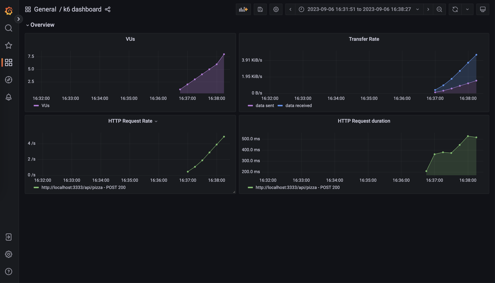

# Evaluate Performance at Massive Scale workshop

- [Evaluate Performance at Massive Scale workshop](#evaluate-performance-at-massive-scale-workshop)
  - [(1) Workshop Intro](#1-workshop-intro)
    - [(1.1) Introduction](#11-introduction)
    - [(1.2) Prerequisites](#12-prerequisites)
    - [(1.3) Playground](#13-playground)
  - [(2) Foundations](#2-foundations)
    - [(2.1) First Test](#21-first-test)
    - [(2.2) VUs and Iterations](#22-vus-and-iterations)
      - [(2.2.1) Think Time :thinking:](#221-think-time-thinking)
      - [(2.2.2) Stages](#222-stages)
    - [(2.4) Checks](#24-checks)
    - [(2.5) Thresholds](#25-thresholds)
    - [(2.6) Import data from a file](#26-import-data-from-a-file)
    - [(2.7) Visualize the results over time with Prometheus and Grafana](#27-visualize-the-results-over-time-with-prometheus-and-grafana)


## (1) Workshop Intro

### (1.1) Introduction

Performance testing is the practice that helps us verify the reliability and performance of our applications.

Reliability has become paramount, and it is now a shared responsibility across all teams. Thus, performance testing has also shifted left, moving closer to frontend and backend developers.

Grafana k6 is a modern, open-source performance testing tool scriptable in Javascript. This interactive workshop provides participants with hands-on experience writing k6 performance tests, giving an overview of performance testing practices and various options for using k6 through practical examples with a demo app.Participants will use Docker compose to install locally a demo environment. 

**Objectives:**

- Learn performance testing fundamentals and guidelines

- Implement different type of load tests and browser performance tests

- Model load tests in terms of throughput and concurrent users

- Implement advanced test scenarios

- Visualize performance results with OSS stack

- Verify SLO compliance in performance tests

- Extend k6 using extensions

### (1.2) Prerequisites

We need requirements to follow the hands-on lab today

* Docker Engine
* VS Code
* Optional: k6
  * You can run it inside Docker, but the experience is better if you install it locally.
    * You get nice colors and dynamic progress bars!
    * Also, it is just a binary, so you can easily remove it afterward if you don't want it.
  * If you plan to use Docker, please, pre-pull the images with:
      ```
      docker pull grafana/k6:0.47.0
      docker pull grafana/k6:0.47.0-with-browser
      ```

### (1.3) Playground

First of all, clone the repository:
```
git clone git@github.com:Athens-SDET-Meetup/devoxx_workshop.git
```
Then, run the playground with:
```
cd devoxx_workshop; docker compose up -d
```
To verify everything is working, go to http://localhost:3333 and click the big button.
If you see a pizza recommendation, that's good!
Also, open http://localhost:3000 and verify that you can see a Grafana instance.

## (2) Foundations

### (2.1) First Test

To run your first test just copy the following

import http from "k6/http";

const BASE_URL = __ENV.BASE_URL || 'http://localhost:3333';

```
export default function () {
  let restrictions = {
    maxCaloriesPerSlice: 500,
    mustBeVegetarian: false,
    excludedIngredients: ["pepperoni"],
    excludedTools: ["knife"],
    maxNumberOfToppings: 6,
    minNumberOfToppings: 2
  }
  let res = http.post(`${BASE_URL}/api/pizza`, JSON.stringify(restrictions), {
    headers: {
      'Content-Type': 'application/json',
      'X-User-ID': 23423,
    },
  });
  console.log(`${res.json().pizza.name} (${res.json().pizza.ingredients.length} ingredients)`);
}
```
in a file called example.js.

Then, run it with:
```
# If you have k6 installed
k6 run example.js
# If you don't have k6 installed
docker run -i --network=devfest-santiago_default grafana/k6:0.47.0 run -e BASE_URL=http://quickpizza:3333  - <example.js
```
That's it :muscle:! You have successfully run your first test :grinning:

Now, you have a lot of things in the output. Let's go through them.

k6's output has three main sections:

k6's output has three main sections:
- 1. Information about the test and its configuration.
  - Why: To quickly understand the test configuration and how it will run.
- 2. Runtime information (e.g., logs).
  - Why: To understand what's happening during the test.
- 3. Summary of the test.
  - Why: To understand how the test went.

In the output's second section, you should see a log line with the pizza name and the number of ingredients. This happens once because k6 has run your default function once. You can also see in the third section lots of metrics that k6 has generated and aggregated for you. These metrics are helpful to understand how the test went (e.g., the number of requests, errors, response time, etc.).


### (2.2) VUs and Iterations

In k6, we have two main concepts: Virtual Users (VUs) and iterations. A VU is a virtual user. It's a thread that runs your script. It's the basic unit of execution in k6. An iteration is a single execution of your script. In the example above, it's a single run of your default function.

You can think of it like a for-loop. You can have many of those; each one will run your script. The number of iterations is the number of times that your script will run. The number of VUs is the number of threads that will run your script.


Let's try it out! After the imports, add a configuration block to your script:
```javascript
export let options = {
  vus: 10,
  duration: "5s",
};
```

Then, run it again :running:.

You should see many more log lines with pizza recommendations in the output. Many things change in the output when you increase the number of VUs and duration, like the values of the VUs and iterations metrics, the number of requests, the response time, etc.

#### (2.2.1) Think Time :thinking:

This is nice! But, we are hammering the service a bit too much. There is no wait/think time between iterations. Let's add sleep to be a bit more gentle:
```javascript
// Add this import at the top of the file
import { sleep } from 'k6';

// Add this line at the end of the default function
sleep(1);
```

Then, rerun the script.

Now, we are getting a pizza recommendation every second. That's better. The number of iterations should be more predictable now. If you have 10VUs and I sleep for 1 second, you should get ten iterations per second! Sometimes, this is not the case because it takes some time for k6 to start the VUs. But that's a setting you can change if you want (you will need to use Scenarios; we cover that later).

If you want more or less requests per second, you can change the number of VUs (or the sleep time!).

#### (2.2.2) Stages

Now, let's try to model a more realistic scenario. We want to simulate a ramp-up of users, then a peak, and then a ramp-down. 

We can do that with stages.

Replace the `options` block with the following:
```javascript
export let options = {
  stages: [
    { duration: "5s", target: 10 },
    { duration: "10s", target: 10 },
    { duration: "5s", target: 0 },
  ],
};
```

Then, rerun the script. 

What's k6 doing?
- During the first 5 seconds, k6 will ramp up from 0 to 10 VUs. 
- Then, it will stay at 10 VUs for 10 seconds.
- Finally, it will ramp down from 10 to 0 VUs in 5 seconds.

> NOTE: The output will be messy if you use Docker to run this test. You can fix that by adding the `--quiet` flag to the k6 command. Why? B/c while using the CLI, you would get a very nice progress bar, telling you how many VUs are running and how your test behaves in real-time. However, when using Docker, k6 will output the progress bar in the logs. 

> TIP: You can always finish the test early by pressing CTRL+C. The summary will still be generated for the data k6 has collected so far.

### (2.4) Checks

Another problem with our script is that we don't validate if the service is working as expected. We are just blindly sending requests and hoping for the best. We can do better than that! We can add checks to our script.

Checks are like assertions. They are a way to verify that a condition is being met.

Let's add a check to our script, to validate that the status of the HTTP response is 200.

First, we need to import the `check` function:
```javascript
import { check } from "k6";
```

Then, we can add a check to our script. You just need to add the following lines after the request:
```javascript
check(res, {
  "is status 200": (r) => r.status === 200,
});
```

Then, rerun the script.

Now, you should see a new section in the output with the results of the checks! You should see that all the checks have passed. That's good!

If you want to see what happens when a check fails, you can change the check to:
```javascript
check(res, {
  "is status 200": (r) => r.status === 500,
});
```

You can learn more about checks [in our docs](https://k6.io/docs/using-k6/checks/).

### (2.5) Thresholds

Thresholds are the pass/fail criteria you define for your test metrics. If the system under test (SUT) does not meet the conditions of your threshold, the test finishes with a failed status. That means that k6 will exit with a non-zero exit code. You can leverage standard metrics that k6 generates or custom metrics that you define in your script (we will see more about this later).

Let's add a threshold to our script. You can do that by changing the `options` block to:
```javascript
export let options = {
  stages: [
    { duration: "5s", target: 10 },
    { duration: "10s", target: 10 },
    { duration: "5s", target: 0 },
  ],
  thresholds: {
    "http_req_duration": ["p(95)<5000"],
  },
};
```

Then, rerun the script. You should see something near the metrics section saying that the threshold passed.

This threshold is saying that 95% of the requests should be faster than 5 seconds. If that's not the case, the threshold fails.

To see what happens when a threshold fails, you can change the threshold to:
```javascript
export let options = {
  stages: [
    { duration: "5s", target: 10 },
    { duration: "10s", target: 10 },
    { duration: "5s", target: 0 },
  ],
  thresholds: {
    "http_req_duration": ["p(95)<10"],
  },
};
```

You can also inspect the status code of the test with:
```bash
# If you have k6 installed, run this after the test finishes
echo $?

# If you don't have k6 installed
docker run -i --network=devfest-santiago_default grafana/k6:0.47.0 run -e BASE_URL=http://quickpizza:3333  - <example.js; echo $?
```

Then, rerun the script.

There is another way of defining thresholds that is a bit more flexible. It even allows you to abort the test if a threshold fails. For example, you could rewrite the previous threshold as:
```javascript
thresholds: {
  "http_req_duration": [
    { threshold: "p(95)<10", abortOnFail: false },
  ],
},
```

You can learn more about thresholds [in our docs](https://k6.io/docs/using-k6/thresholds/).

### (2.6) Import data from a file

So far, we have been using some hard-coded data. Let's change that! 

We will make the customerID we add to every request dynamic, with data from a JSON file.

To accomplish that, we first need to create a file named `customers.json` with some customer id's:
```json
{
  "customers": [
    12351,
    12352,
    12353,
    12354,
    12355,
    12356
  ]
}
```

Then, we need to load this data in k6. There are multiple ways to do that, but one of the easiest and most optimal is using our ShareArray library. This library will load the data once and let all the VUs read it.

To use it, we need to import it:
```javascript
import { SharedArray } from "k6/data";
```

Then, we need to load the data:
```javascript
// Add this line after the options block, outside of the default function - we want to load the data once!
const customers = new SharedArray('all my customers', function () {
  return JSON.parse(open('./customers.json')).customers;
});
```

Finally, we can use it in our script. Let's replace the HTTP request with:
```javascript
let res = http.post(`${BASE_URL}/api/pizza`, JSON.stringify(restrictions), {
  headers: {
    'Content-Type': 'application/json',
    'X-User-ID': customers[Math.floor(Math.random() * customers.length)],
  },
});
```

> NOTE: If you are using docker, you need to mount the `customers.json` file. You can do that by adding the following flag to the docker command: `-v $(pwd)/customers.json:/customers.json`.

That way, we will pick a random customer from the list of customers.  Then, rerun the script. 

If you check the logs of the QuickPizza service, you should see that the customer id that we attach to every log line is changing all the time. 

You verify this by running `docker-compose logs quickpizza`.

You can learn more about data parameterization in k6 [in our docs](https://k6.io/docs/examples/data-parameterization/).

### (2.7) Visualize the results over time with Prometheus and Grafana

The output of k6 is nice, but it's not possible understand how the metrics evolved over time.

To solve this, k6 has Outputs. These let you export your metrics/logs to some other place in real-time. One of the most popular outputs is the Prometheus output. This output will export your metrics to a Prometheus instance, so you can use Grafana to visualize the metrics in real time.

The Docker Compose playground already has a Prometheus and Grafana instance running. So, let's use that!

You just need to change how you invoke k6, and add the Prometheus output:
```bash
# If you have k6 installed
k6 run --out=experimental-prometheus-rw example.js

# If you don't have k6 installed
docker run -i --network=devfest-santiago_default grafana/k6:0.47.0 run --out=experimental-prometheus-rw -e BASE_URL=http://quickpizza:3333 -e K6_PROMETHEUS_RW_SERVER_URL=http://prometheus:9090/api/v1/write - <example.js
```

Then, run the script again. After that, open http://localhost:3000. 

Then, go to dashboards and click on the k6 dashboard ([this URL should get you there](http://localhost:3000/d/e53a57f8-56e2-4b0c-88f4-9537296a3f48/k6-dashboard?orgId=1&refresh=10s)). 

You should see a dashboard with some metrics, that are being updated in real time.



> NOTE: Why is this feature experimental? Only because it has been added pretty recently to k6. But it is already very stable and used by lots of people.

> TIP: Because of how Prometheus metrics work, metrics will be active for five minutes after the last flushed sample. This can be confusing b/c metrics will keep going with the last value even if the test has already finished. To avoid this, you can use the following environment variable: `K6_PROMETHEUS_RW_STALE_MARKERS=true`.

You can learn more about [outputs](https://k6.io/docs/results-output/overview/) in our docs.