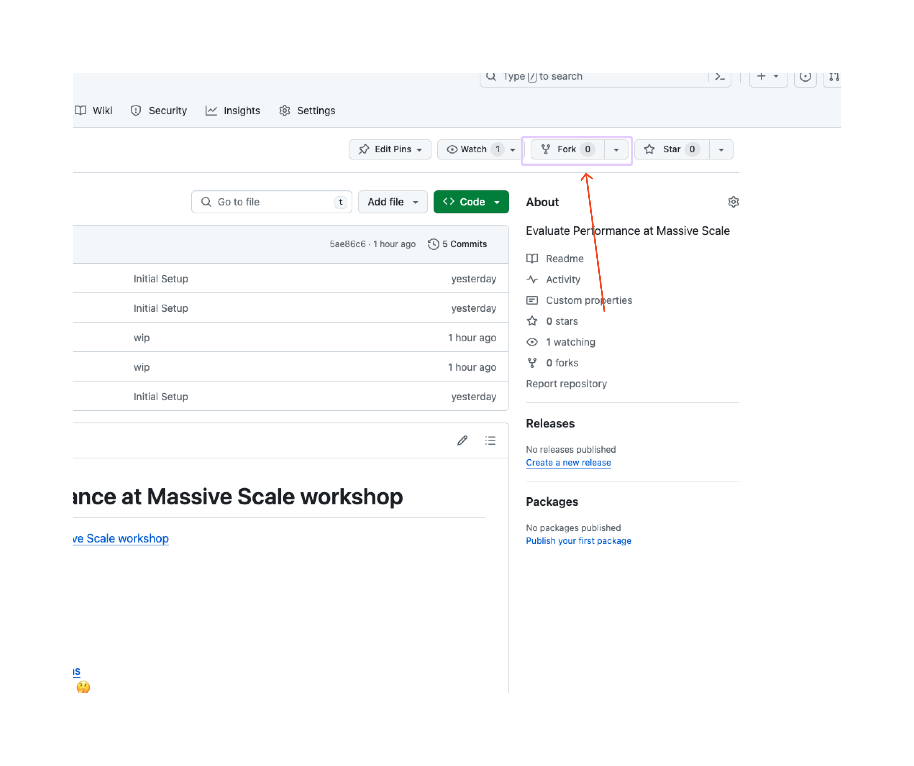
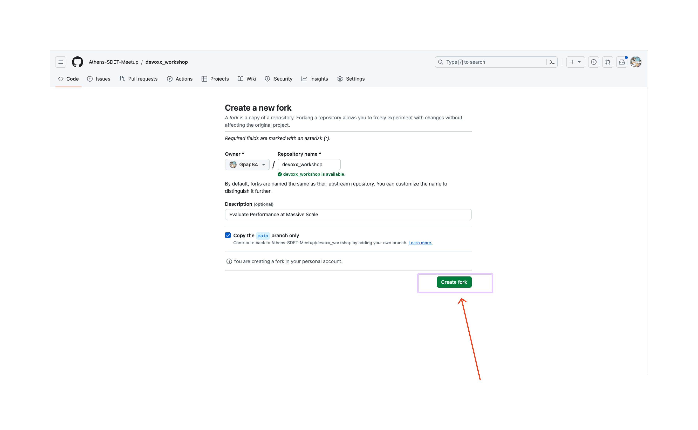
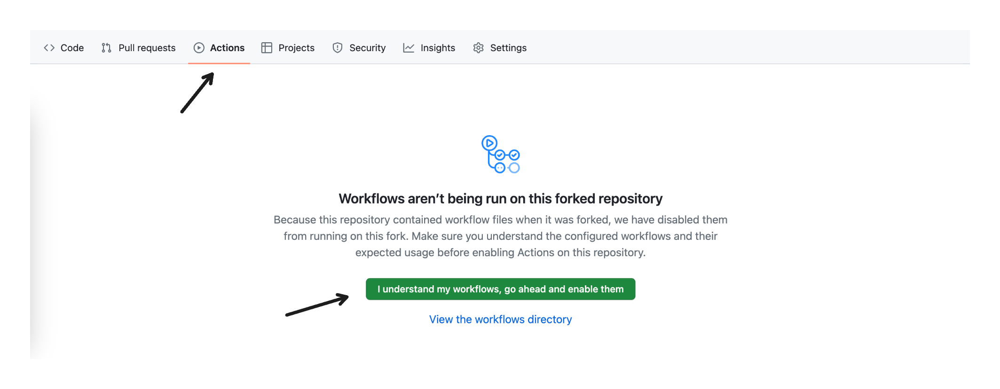
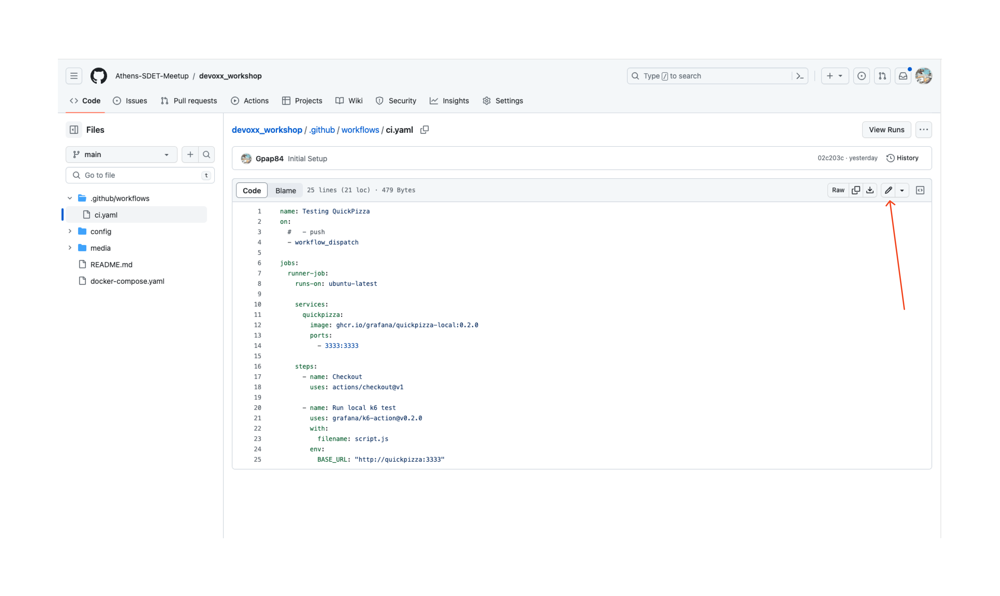
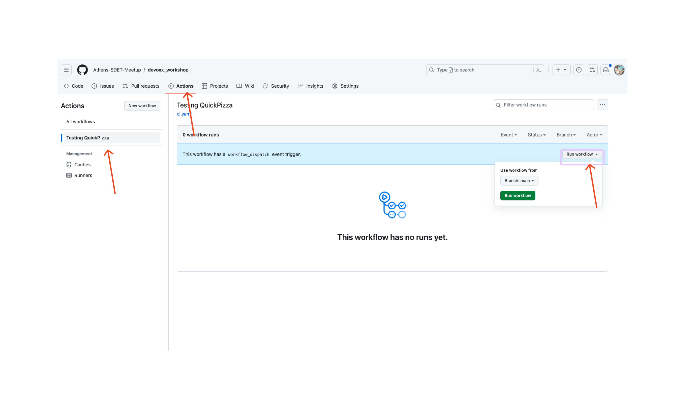
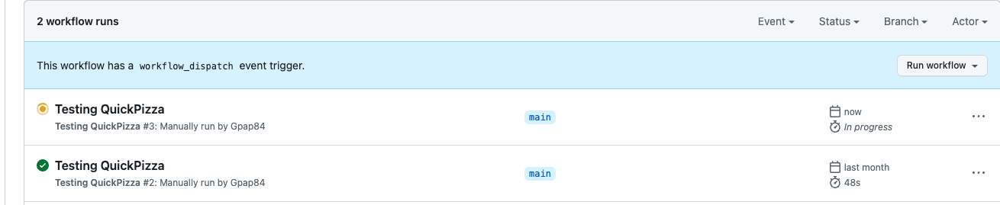
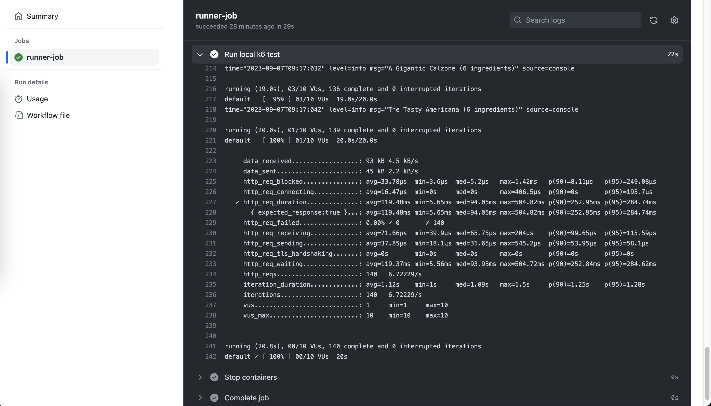
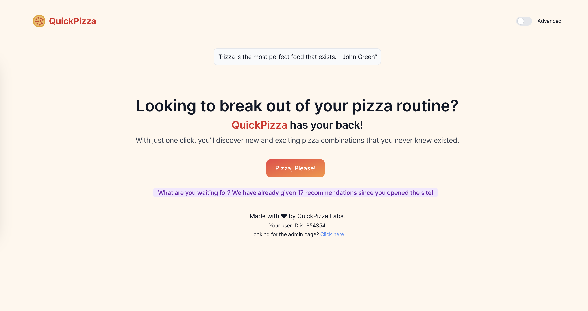
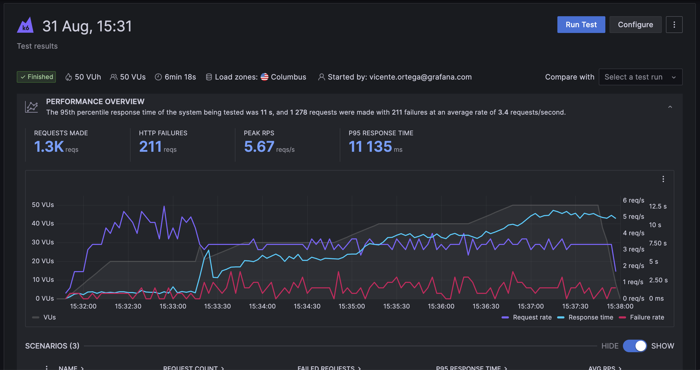

# Evaluate Performance at Massive Scale workshop

- [Evaluate Performance at Massive Scale workshop](#evaluate-performance-at-massive-scale-workshop)
  - [(1) Workshop Intro](#1-workshop-intro)
    - [(1.1) Introduction :nerd\_face:](#11-introduction-nerd_face)
    - [(1.2) Prerequisites :dependabot:](#12-prerequisites-dependabot)
    - [(1.3) Playground :soccer:](#13-playground-soccer)
  - [(2) Foundations](#2-foundations)
    - [(2.1) First Test :test\_tube:](#21-first-test-test_tube)
    - [(2.2) VUs and Iterations :electron:](#22-vus-and-iterations-electron)
      - [(2.2.1) Think Time :thinking:](#221-think-time-thinking)
      - [(2.2.2) Stages :octocat:](#222-stages-octocat)
    - [(2.4) Checks :green\_circle:](#24-checks-green_circle)
    - [(2.5) Thresholds :red\_circle:](#25-thresholds-red_circle)
    - [(2.6) Import data from a file :open\_file\_folder:](#26-import-data-from-a-file-open_file_folder)
    - [(2.7) Visualize the results over time with Prometheus and Grafana :partying\_face:](#27-visualize-the-results-over-time-with-prometheus-and-grafana-partying_face)
    - [(2.8) More details :face\_with\_spiral\_eyes:](#28-more-details-face_with_spiral_eyes)
      - [(2.8.1) Lifecycle :globe\_with\_meridians:](#281-lifecycle-globe_with_meridians)
      - [(2.8.2) CLI overrides and environment variables :earth\_americas:](#282-cli-overrides-and-environment-variables-earth_americas)
      - [(2.8.3) Custom metrics :placard:](#283-custom-metrics-placard)
      - [(2.8.4) Summary Reporter :chart\_with\_upwards\_trend:](#284-summary-reporter-chart_with_upwards_trend)
      - [(2.8.5) Web Reporter :chart\_with\_upwards\_trend:](#285-web-reporter-chart_with_upwards_trend)
  - [(3) Running k6 in CI](#3-running-k6-in-ci)
    - [(3.1) GitHub Actions :octocat:](#31-github-actions-octocat)
    - [(3.2) Other CI providers](#32-other-ci-providers)
  - [(4) Advanced](#4-advanced)
    - [(4.1) Scenarios](#41-scenarios)
    - [(4.2) Modules](#42-modules)
    - [(4.3) More stuff](#43-more-stuff)
      - [(4.3.1) Browser Performance](#431-browser-performance)
      - [(4.3.2) Composability](#432-composability)
      - [(4.3.3) Extensions](#433-extensions)
      - [(4.3.4) WebSockets](#434-websockets)
  - [(5) More things](#5-more-things)
    - [(5.1) Grafana Cloud k6 :cloud:](#51-grafana-cloud-k6-cloud)
    - [(5.2) Fault Injection :x:](#52-fault-injection-x)
    - [(5.3) Kubernetes Operator](#53-kubernetes-operator)


## (1) Workshop Intro

### (1.1) Introduction :nerd_face:

Performance testing is the practice that helps us verify the reliability and performance of our applications.

Reliability has become paramount, and it is now a shared responsibility across all teams. Thus, performance testing has also shifted left, moving closer to frontend and backend developers.

Grafana k6 is a modern, open-source performance testing tool scriptable in Javascript. This interactive workshop provides participants with hands-on experience writing k6 performance tests, giving an overview of performance testing practices and various options for using k6 through practical examples with a demo app.Participants will use Docker compose to install locally a demo environment. 

**Objectives:**

- Learn performance testing fundamentals and guidelines

- Implement different type of load tests and browser performance tests

- Model load tests in terms of throughput and concurrent users

- Implement advanced test scenarios

- Visualize performance results with OSS stack

- Verify SLO compliance in performance tests

- Extend k6 using extensions

### (1.2) Prerequisites :dependabot:	

We need requirements to follow the hands-on lab today

* [Docker Engine](https://docs.docker.com/engine/install/)
* [VS Code](https://code.visualstudio.com/download)
* Optional: [k6](https://k6.io/docs/get-started/installation/)
  * You can run it inside Docker, but the experience is better if you install it locally.
    * You get nice colors and dynamic progress bars!
    * Also, it is just a binary, so you can easily remove it afterward if you don't want it.
  * If you plan to use Docker, please, pre-pull the images with:
      ```
      docker pull grafana/k6:0.47.0
      docker pull grafana/k6:0.47.0-with-browser
      ```

### (1.3) Playground :soccer:

First of all, clone the repository:
```
git clone git@github.com:Athens-SDET-Meetup/performance_workshop.git
```
Then, run the playground with:
```
cd performance_workshop; docker compose up -d
```
To verify everything is working, go to http://localhost:3333 and click the big button.
If you see a pizza recommendation, that's good!
Also, open http://localhost:3000 and verify that you can see a Grafana instance.

## (2) Foundations

### (2.1) First Test :test_tube:

To run your first test just copy the following


```
import http from "k6/http";

const BASE_URL = __ENV.BASE_URL || 'http://localhost:3333';

export default function () {
  let restrictions = {
    maxCaloriesPerSlice: 500,
    mustBeVegetarian: false,
    excludedIngredients: ["pepperoni"],
    excludedTools: ["knife"],
    maxNumberOfToppings: 6,
    minNumberOfToppings: 2
  }
  let res = http.post(`${BASE_URL}/api/pizza`, JSON.stringify(restrictions), {
    headers: {
      'Content-Type': 'application/json',
      'X-User-ID': 23423,
    },
  });
  console.log(`${res.json().pizza.name} (${res.json().pizza.ingredients.length} ingredients)`);
}
```
in a file called example.js.

Then, run it with:
```
# If you have k6 installed
k6 run example.js
# If you don't have k6 installed
docker run -i --network=performance_workshop_default grafana/k6:0.47.0 run -e BASE_URL=http://quickpizza:3333  - <example.js
```
That's it :muscle:! You have successfully run your first test :grinning:

Now, you have a lot of things in the output. Let's go through them.

k6's output has three main sections:
- 1. Information about the test and its configuration.
  - Why: To quickly understand the test configuration and how it will run.
- 2. Runtime information (e.g., logs).
  - Why: To understand what's happening during the test.
- 3. Summary of the test.
  - Why: To understand how the test went.

In the output's second section, you should see a log line with the pizza name and the number of ingredients. This happens once because k6 has run your default function once. You can also see in the third section lots of metrics that k6 has generated and aggregated for you. These metrics are helpful to understand how the test went (e.g., the number of requests, errors, response time, etc.).


### (2.2) VUs and Iterations :electron:

In k6, we have two main concepts: Virtual Users (VUs) and iterations. A VU is a virtual user. It's a thread that runs your script. It's the basic unit of execution in k6. An iteration is a single execution of your script. In the example above, it's a single run of your default function.

You can think of it like a for-loop. You can have many of those; each one will run your script. The number of iterations is the number of times that your script will run. The number of VUs is the number of threads that will run your script.


Let's try it out! After the imports, add a configuration block to your script:
```javascript
export let options = {
  vus: 10,
  duration: "5s",
};
```

Then, run it again :running:.

You should see many more log lines with pizza recommendations in the output. Many things change in the output when you increase the number of VUs and duration, like the values of the VUs and iterations metrics, the number of requests, the response time, etc.

#### (2.2.1) Think Time :thinking:

This is nice! But, we are hammering the service a bit too much. There is no wait/think time between iterations. Let's add sleep to be a bit more gentle:
```javascript
// Add this import at the top of the file
import { sleep } from 'k6';

// Add this line at the end of the default function
sleep(1);
```

Then, rerun the script.

Now, we are getting a pizza recommendation every second. That's better. The number of iterations should be more predictable now. If you have 10VUs and I sleep for 1 second, you should get ten iterations per second! Sometimes, this is not the case because it takes some time for k6 to start the VUs. But that's a setting you can change if you want (you will need to use Scenarios; we cover that later).

If you want more or less requests per second, you can change the number of VUs (or the sleep time!).

#### (2.2.2) Stages :octocat:

Now, let's try to model a more realistic scenario. We want to simulate a ramp-up of users, then a peak, and then a ramp-down. 

We can do that with stages.

Replace the `options` block with the following:
```javascript
export let options = {
  stages: [
    { duration: "5s", target: 10 },
    { duration: "10s", target: 10 },
    { duration: "5s", target: 0 },
  ],
};
```

Then, rerun the script. 

What's k6 doing :nerd_face:? 
- During the first 5 seconds, k6 will ramp up from 0 to 10 VUs. 
- Then, it will stay at 10 VUs for 10 seconds.
- Finally, it will ramp down from 10 to 0 VUs in 5 seconds.

> NOTE: The output will be messy if you use Docker to run this test. You can fix that by adding the `--quiet` flag to the k6 command. Why? B/c while using the CLI, you would get a very nice progress bar, telling you how many VUs are running and how your test behaves in real-time. However, when using Docker, k6 will output the progress bar in the logs. 

> TIP: You can always finish the test early by pressing CTRL+C. The summary will still be generated for the data k6 has collected so far.

### (2.4) Checks :green_circle:

Another problem with our script is that we don't validate if the service is working as expected. We are just blindly sending requests and hoping for the best. We can do better than that! We can add checks to our script.

Checks are like assertions. They are a way to verify that a condition is being met.

Let's add a check to our script, to validate that the status of the HTTP response is 200.

First, we need to import the `check` function:
```javascript
import { check } from "k6";
```

Then, we can add a check to our script. You just need to add the following lines after the request:
```javascript
check(res, {
  "is status 200": (r) => r.status === 200,
});
```

Then, rerun the script.

Now, you should see a new section in the output with the results of the checks! You should see that all the checks have passed. That's good!

If you want to see what happens when a check fails, you can change the check to:
```javascript
check(res, {
  "is status 200": (r) => r.status === 500,
});
```

You can learn more about checks [in our docs](https://k6.io/docs/using-k6/checks/).

### (2.5) Thresholds :red_circle:

Thresholds are the pass/fail criteria you define for your test metrics. If the system under test (SUT) does not meet the conditions of your threshold, the test finishes with a failed status. That means that k6 will exit with a non-zero exit code. You can leverage standard metrics that k6 generates or custom metrics that you define in your script (we will see more about this later).

Let's add a threshold to our script. You can do that by changing the `options` block to:
```javascript
export let options = {
  stages: [
    { duration: "5s", target: 10 },
    { duration: "10s", target: 10 },
    { duration: "5s", target: 0 },
  ],
  thresholds: {
    "http_req_duration": ["p(95)<5000"],
  },
};
```

Then, rerun the script. You should see something near the metrics section saying that the threshold passed.

This threshold is saying that 95% of the requests should be faster than 5 seconds. If that's not the case, the threshold fails.

To see what happens when a threshold fails, you can change the threshold to:
```javascript
export let options = {
  stages: [
    { duration: "5s", target: 10 },
    { duration: "10s", target: 10 },
    { duration: "5s", target: 0 },
  ],
  thresholds: {
    "http_req_duration": ["p(95)<10"],
  },
};
```

You can also inspect the status code of the test with:
```bash
# If you have k6 installed, run this after the test finishes
echo $?

# If you don't have k6 installed
docker run -i --network=performance_workshop_default grafana/k6:0.47.0 run -e BASE_URL=http://quickpizza:3333  - <example.js; echo $?
```

Then, rerun the script.

There is another way of defining thresholds that is a bit more flexible. It even allows you to abort the test if a threshold fails. For example, you could rewrite the previous threshold as:
```javascript
thresholds: {
  "http_req_duration": [
    { threshold: "p(95)<10", abortOnFail: false },
  ],
},
```

You can learn more about thresholds [in our docs](https://k6.io/docs/using-k6/thresholds/).

### (2.6) Import data from a file :open_file_folder:

So far, we have been using some hard-coded data. Let's change that! 

We will make the customerID we add to every request dynamic, with data from a JSON file.

To accomplish that, we first need to create a file named `customers.json` with some customer id's:
```json
{
  "customers": [
    12351,
    12352,
    12353,
    12354,
    12355,
    12356
  ]
}
```

Then, we need to load this data in k6. There are multiple ways to do that, but one of the easiest and most optimal is using our ShareArray library. This library will load the data once and let all the VUs read it.

To use it, we need to import it:
```javascript
import { SharedArray } from "k6/data";
```

Then, we need to load the data:
```javascript
// Add this line after the options block, outside of the default function - we want to load the data once!
const customers = new SharedArray('all my customers', function () {
  return JSON.parse(open('./customers.json')).customers;
});
```

Finally, we can use it in our script. Let's replace the HTTP request with:
```javascript
let res = http.post(`${BASE_URL}/api/pizza`, JSON.stringify(restrictions), {
  headers: {
    'Content-Type': 'application/json',
    'X-User-ID': customers[Math.floor(Math.random() * customers.length)],
  },
});
```

> NOTE: If you are using docker, you need to mount the `customers.json` file. You can do that by adding the following flag to the docker command: `-v $(pwd)/customers.json:/customers.json`.

That way, we will pick a random customer from the list of customers.  Then, rerun the script. 

If you check the logs of the QuickPizza service, you should see that the customer id that we attach to every log line is changing all the time. 

You verify this by running `docker-compose logs quickpizza`.

You can learn more about data parameterization in k6 [in our docs](https://k6.io/docs/examples/data-parameterization/).

### (2.7) Visualize the results over time with Prometheus and Grafana :partying_face:

The output of k6 is nice, but it's not possible understand how the metrics evolved over time.

To solve this, k6 has Outputs. These let you export your metrics/logs to some other place in real-time. One of the most popular outputs is the Prometheus output. This output will export your metrics to a Prometheus instance, so you can use Grafana to visualize the metrics in real time.

The Docker Compose playground already has a Prometheus and Grafana instance running. So, let's use that!

You just need to change how you invoke k6, and add the Prometheus output:
```bash
# If you have k6 installed
k6 run --out=experimental-prometheus-rw example.js

# If you don't have k6 installed
docker run -i --network=performance_workshop_default grafana/k6:0.47.0 run --out=experimental-prometheus-rw -e BASE_URL=http://quickpizza:3333 -e K6_PROMETHEUS_RW_SERVER_URL=http://prometheus:9090/api/v1/write - <example.js
```

Then, run the script again. After that, open http://localhost:3000. 

Then, go to dashboards and click on the k6 dashboard ([this URL should get you there](http://localhost:3000/d/e53a57f8-56e2-4b0c-88f4-9537296a3f48/k6-dashboard?orgId=1&refresh=10s)). 

You should see a dashboard with some metrics, that are being updated in real time.


> NOTE: Why is this feature experimental? Only because it has been added pretty recently to k6. But it is already very stable and used by lots of people.

> TIP: Because of how Prometheus metrics work, metrics will be active for five minutes after the last flushed sample. This can be confusing b/c metrics will keep going with the last value even if the test has already finished. To avoid this, you can use the following environment variable: `K6_PROMETHEUS_RW_STALE_MARKERS=true`.

You can learn more about [outputs](https://k6.io/docs/results-output/overview/) in our docs.

### (2.8) More details :face_with_spiral_eyes:

In case you have time (now or later), here are some more things that you can learn about and try out.

#### (2.8.1) Lifecycle :globe_with_meridians:	

In k6, there are four lifecycle stages.

```javascript
// 1. init code

export function setup() {
  // 2. setup code
}

export default function (data) {
  // 3. VU code
}

export function teardown(data) {
  // 4. teardown code
}
```

- Code in the init context prepares the script, loading files, importing modules, and defining the test lifecycle functions. **Required**.
- The setup function runs, setting up the test environment and generating data. *Optional*.
- VU code runs in the default or scenario (we mention this later) function, running for as long and as many times as the options define. **Required**.
- The teardown function runs, postprocessing data and closing the test environment. *Optional*.

You can use the lifecycle functions to do things like, not running the test if the service is down! You could do something like that by adding the following code to your script:
```javascript
export function setup() {
  let res = http.get(BASE_URL)
  if (res.status !== 200) {
    throw new Error(`Got unexpected status code ${res.status} when trying to setup. Exiting.`)
  }
}
```

You can learn more about the lifecycle functions [in our docs](https://k6.io/docs/using-k6/test-lifecycle/).

#### (2.8.2) CLI overrides and environment variables :earth_americas:

Most things you can configure in the `options` block can also be overridden via the CLI. For example, you can override the number of VUs with the `--vus` flag and the duration with the `--duration` flag.

That means that the same script can be used to run different tests. You can have a single script that you can use to run a smoke test, a load test, a soak test, etc. You just need to change the CLI arguments!

Alternatively, you can control the test configuration via environment variables. We have many of them, but you can also create your own and modify your script's behavior based on them. Also, you can use environment variables to pass secrets to your script (e.g., API keys).

You can pass environment variables to k6 in multiple ways:
```bash
k6 run -e MY_ENV_VAR=123 example.js
# or
MY_ENV_VAR=123 k6 run example.js
```

Then, you can use it in your script with the `__ENV` object:
```javascript
console.log(__ENV.MY_ENV_VAR);
```

If you noticed, we have been using the `BASE_URL` environment variable to pass the URL of the QuickPizza service to our script. That's why we can run the same script locally and in Docker without changing anything!

You can learn more about [how options work](https://k6.io/docs/using-k6/k6-options/how-to/) and [environment variables](https://k6.io/docs/using-k6/environment-variables/) in our docs.

#### (2.8.3) Custom metrics :placard:

By default, k6 automatically collects built-in metrics. Besides built-ins, you can also make custom metrics.

Metrics fall into four broad types:

- **Counters**: sum values.
- **Gauges**: track the smallest, largest, and latest values.
- **Rates**: track how frequently a non-zero value occurs.
- **Trends**: calculates statistics for multiple values (like mean, mode or percentile).

You can create them by using our metrics library. Let's try it out!

For QuickPizza, let's create a custom metric to track the number of pizzas that have been recommended and another one to track the number of ingredients each pizza has. You first need to import the metrics library:
```javascript
import { Trend, Counter } from "k6/metrics";
```

Then, you can create the metrics:
```javascript
// Put this after the options block, outside of the default function
const pizzas = new Counter('quickpizza_number_of_pizzas');
const ingredients = new Trend('quickpizza_ingredients');
```

Later, in the default function, you can use your metrics after the HTTP request is made:
```javascript
// We increment the number of pizzas by 1
pizzas.add(1);

// We add the number of ingredients of the pizza to the trend
ingredients.add(res.json().pizza.ingredients.length);
```

When you run the test, you should be able to see these new metrics in the summary section of the output.

You can learn more about metrics [in our docs](https://k6.io/docs/using-k6/metrics/).

#### (2.8.4) Summary Reporter :chart_with_upwards_trend:

You have already seen multiple times the end-of-test summary. You can customize it! 

To customize it, you need to leverage the `handleSummary` function. 

After your test runs, k6 aggregates your metrics into a JavaScript object. The `handleSummary()`` function takes this object as an argument (called data in all examples here).

Use `handleSummary()`` to create a custom summary or return the default object.

Let's try it out. Add, at the end of your script, the following:
```javascript
export function handleSummary(data) {
  return {
    'summary.json': JSON.stringify(data), //the default data object
  };
}
```
If you run the test again, you should see a new file named `summary.json` with all the data the summary would have.

Fundamentally, `handleSummary()`` is just a function that can access a data object. As such, you can transform the summary data into any text format: JSON, HTML, console, XML, and so on. You can pipe your custom summary to standard output or standard error, write it to a file, or send it to a remote server.

k6 calls `handleSummary()`` at the end of the test lifecycle.

You can learn more about this [in our docs](https://k6.io/docs/results-output/end-of-test/custom-summary/).

#### (2.8.5) Web Reporter :chart_with_upwards_trend:

Let’s jump straight to it.

set K6_WEB_DASHBOARD=true and then your k6 command, lets say k6 run script.js

## (3) Running k6 in CI

### (3.1) GitHub Actions :octocat:

We are going to use GitHub Actions to run one of our tests. You can do this in multiple ways (manually installing it, with the Docker container, etc.), but in this case, we are going to use the k6 GitHub Action.

Start by forking this repository  (yup, the performance_workshop repo). First, click in `Fork`:


Then, click on `Create fork`.


In the forked repository, go to the `Actions tab` and click on the green button that enables GitHub Actions.


After that, you can go to your forked repository and edit the file `.github/workflows/main.yml`:


Add the following to the file:
```yaml
name: Testing QuickPizza
on: 
 - push
 - workflow_dispatch

jobs:
  runner-job:
    runs-on: ubuntu-latest

    services:
      quickpizza:
        image: ghcr.io/grafana/quickpizza-local:0.2.0
        ports:
          - 3333:3333

    steps:
      - name: Checkout
        uses: actions/checkout@v1
  
      - name: Run local k6 test
        uses: grafana/k6-action@v0.2.0
        with:
          filename: script.js
        env:
          BASE_URL: "http://quickpizza:3333"
```

This workflow will run every time you push *something* to your repository. It will start a QuickPizza container in the background and run the `script.js` script against it. You can see the contents of the script in the file `script.js`. 

The test is very similar to the one you created earlier.

That's it! For every new commit, GitHub will run your test and tell you if it passed or failed. 

Also, because we added the `workflow_dispatch` listener, you can manually trigger the workflow from the UI. You can do that navigating to the Actions tab and finding the workflow you just created. Then, click on the `Run workflow` button.




You should see see how the workflow is running.



You can click on the workflow and then click on the runner-job box.

There, you will see all the steps that were executed. You can click on each step to see the logs! 

In the k6 step, you can see k6's output:



The step will fail if thresholds are not met. You can test this quickly by replacing the threshold target with a tiny value, e.g., 1 instead of 5000, and triggering a new CI run. 

As you can see, running k6 in CI is quite straightforward. If you want a more extensive example, you can check [this blog post](https://k6.io/blog/load-testing-using-github-actions/) which goes much more in-depth.

### (3.2) Other CI providers

Even if the instructions above target GitHub actions, you can try this section in any CI provider! 

We have guides for many of them. You can check them out [here](https://k6.io/docs/integrations/#continuous-integration-and-continuous-delivery).

## (4) Advanced

### (4.1) Scenarios

Scenarios configure how VUs and iteration are executed in a more fine-grained way. With scenarios, you can model diverse workloads, or traffic patterns in your tests.

Benefits of using scenarios include:

- Easier, more flexible test organization.
- Simulate more realistic traffic. 
- Parallel or sequential workloads. 
- Granular results analysis.

Let's try it out! To use scenarios, you need to change the `options` - an example is:
```javascript
export let options = {
  scenarios: {
    smoke: {
      executor: "constant-vus",
      vus: 1,
      duration: "10s",
    },
    load: {
      executor: "ramping-vus",
      startVUs: 0,
      stages: [
        { duration: '5s', target: 5 },
        { duration: '10s', target: 5 },
        { duration: '5s', target: 0 },
      ],
      gracefulRampDown: "5s",
      startTime: "10s",
    },
  },
};
```

In this case, we have defined two scenarios: `smoke` and `load`. The `smoke` scenario will run with a single VU for 10 seconds. The `load` scenario will ramp up from 0 to 5 VUs in 5 seconds, stay at 5 VUs for 10 seconds, and then ramp down to 0 VUs in 5 seconds. The second scenario will start 10 seconds after the first one.

As you can see, we are using two types of executors, `constant-vus` and `ramping-vus`. These are similar to what we have seen earlier and are focused on VUs. But other executors are focused on the number of iterations and iteration rate (e.g., `per-vu-iterations` and `constant-arrival-rate`). 

Let's change our script to use scenarios and rerun the test. If you are running k6 locally, you should see two progress bars, one for each scenario, telling you how many VUs are running and how your test behaves in real time.

> TIP: You can use `exec` to run a specific function in your script instead of the default function. For example, you could configure a scenario to run the `functionA` function, and another scenario to run the `functionB` function. If you don't specify an `exec` property, k6 will run the default function. 

You can learn more about scenarios [in our docs](https://k6.io/docs/using-k6/scenarios/).

### (4.2) Modules

k6 provides many built-in modules for core functionalities. For example, the http client make requests against the system under test. For the full list of built-in modules, refer to the [API documentation](https://k6.io/docs/javascript-api/).

But you can also create your own modules! You can use modules to share code between scripts or build a library of functions you can use in your scripts.

Creating a module is easy. You make a file with the functions you want to export and import them into your script. Let's try it out!

First, create a file named `utils.js` with the following content:
```javascript
export function getPizzaName(res) {
  return res.json().pizza.name;
}
```

Then, import it in your script:
```javascript
import { getPizzaName } from './utils.js';
```

Finally, use it in your script:
```javascript
// Use it after the HTTP request
console.log(getPizzaName(res));
```

Then, rerun the script. You should see an additional log line with the pizza name in the output.

```bash
# If you have k6 installed
k6 run example.js

# If you don't have k6 installed (you need to mount the extra file)
docker run -i --network=performance_workshop_default -v $(pwd)/utils.js:/utils.js grafana/k6:0.47.0 run -e BASE_URL=http://quickpizza:3333  - <example.js
```

You can learn more about modules [in our docs](https://k6.io/docs/using-k6/modules/).

### (4.3) More stuff

#### (4.3.1) Browser Performance

Even though we have been using HTTP requests so far, k6 is not limited to that. You can use it to test all kinds of things! It natively supports other protocols like gRPC, WebSockets, and Redis - and you can extend it to support more (we chat a bit about extensions later on!).

You can also use it to interact and test your web apps, as with Playwright/Puppeteer. This will be the focus of this section. We will use the Browser testing APIs of k6 to get a pizza recommendation, take a screenshot of the result, and verify the page's performance (by checking its web vitals metrics).

To do that, let's create a new script named `browser.js` with the following content:
```javascript
import { browser } from "k6/experimental/browser";
import { check } from "k6";

const BASE_URL = __ENV.BASE_URL || "http://localhost:3333";

export const options = {
  scenarios: {
    ui: {
      executor: "shared-iterations",
      options: {
        browser: {
          type: "chromium",
        },
      },
    },
  },
};

export default async function () {
  const page = browser.newPage();

  try {
    await page.goto(BASE_URL);
    check(page, {
      header:
        page.locator("h1").textContent() ==
        "Looking to break out of your pizza routine?",
    });

    await page.locator('//button[. = "Pizza, Please!"]').click();
    page.waitForTimeout(500);
    page.screenshot({ path: "screenshot.png" });
    check(page, {
      recommendation: page.locator("div#recommendations").textContent() != "",
    });
  } finally {
    page.close();
  }
}
```

There are things in the script that we have already talked about, like Checks and Scenarios. But there are also new things, like the `browser` import and the `page` object. These APIs that k6 provides will drive a real browser under the hood. In this script, we go to the QuickPizza page, click the big button, take a screenshot of the result, and verify that the recommendation is not empty. 

To run this script, you must have a Chromium browser installed if you run k6 locally:
```bash
# If you have k6 installed
k6 run browser.js
```

If you want to use Docker, you can:
```bash
docker run -i --network=performance_workshop_default --cap-add=SYS_ADMIN grafana/k6:0.47.0-with-browser run  -e BASE_URL=http://quickpizza:3333 - <browser.js

# Find the container ID of that container you just ran
docker container ls -a

# Copy the screenshot to your local machine
docker cp <container_id>:/home/k6/screenshot.png .

# Note: If you are using a MacBook M1/M2 --> Make sure you have rosetta installed and virtualization enabled in Docker.
```

Then, open the `screenshot.png` file. You should see a screenshot of the QuickPizza page with a pizza recommendation.

Also, you should be able to see the Checks we have defined in the output. Plus, lots of new metrics! These metrics are related to the performance of the page. You can use them to understand how your page is performing and how it is affecting your users. Lots of them are [Web Vitals metrics](https://web.dev/vitals/), which are a set of metrics that Google recommends to measure the user experience on the web.

You can learn more about the Browser APIs [in our docs](https://k6.io/docs/using-k6-browser/overview/).

#### (4.3.2) Composability

In k6, you can mix and match the features you need to test what you really need to test.

For example, you can use k6 to generate some constant load in your HTTP API while using the Browser APIs to test your web app to understand better how the frontend behaves and what your users are experiencing when using your app.

Accomplishing this is easy with Scenarios. You can define multiple scenarios, each one with its own configuration. Then, you can run them all at the same time.

Let's try it out! Create a new script named `mixed.js` with the following content:
```javascript
import http from "k6/http";
import { check, sleep } from "k6";
import { browser } from "k6/experimental/browser";

const BASE_URL = __ENV.BASE_URL || 'http://localhost:3333';

export const options = {
  scenarios: {
    smoke: {
      exec: "getPizza",
      executor: "constant-vus",
      vus: 1,
      duration: "10s",
    },
    stress: {
      exec: "getPizza",
      executor: "ramping-vus",
      stages: [
        { duration: '5s', target: 5 },
        { duration: '10s', target: 5 },
        { duration: '5s', target: 0 },
      ],
      gracefulRampDown: "5s",
      startTime: "10s",
    },
    browser: {
      exec: "checkFrontend",
      executor: "constant-vus",
      vus: 1,
      duration: "30s",
      options: {
        browser: {
          type: "chromium",
        },
      },
    }
  },
};

export function getPizza() {
  let restrictions = {
    maxCaloriesPerSlice: 500,
    mustBeVegetarian: false,
    excludedIngredients: ["pepperoni"],
    excludedTools: ["knife"],
    maxNumberOfToppings: 6,
    minNumberOfToppings: 2
  }
  let res = http.post(`${BASE_URL}/api/pizza`, JSON.stringify(restrictions), {
    headers: {
      'Content-Type': 'application/json',
      'X-User-ID': 1231231,
    },
  });
  check(res, { "status is 200": (res) => res.status === 200 });
  console.log(`${res.json().pizza.name} (${res.json().pizza.ingredients.length} ingredients)`);
  sleep(1);
}

export async function checkFrontend() {
  const page = browser.newPage();

  try {
    await page.goto(BASE_URL)
    check(page, {
      'header': page.locator('h1').textContent() == 'Looking to break out of your pizza routine?',
    });

    await page.locator('//button[. = "Pizza, Please!"]').click();
    page.waitForTimeout(500);
    page.screenshot({ path: `screenshots/${__ITER}.png` });
    check(page, {
      'recommendation': page.locator('div#recommendations').textContent() != '',
    });
  } finally {
    page.close();
  }
}
```

That's it. Now, you should be able to run it as you would do with any test, and you get the best of both worlds!

You can read more about that scenario in [this section](https://k6.io/docs/using-k6-browser/running-browser-tests/#run-both-browser-level-and-protocol-level-tests-in-a-single-script) of our docs.

#### (4.3.3) Extensions

With k6 extensions, you can create custom k6 binaries to support your specific reliability-testing needs. These are written in Go and can be used to extend k6 with new protocols, outputs, etc. For example, you could create an extension to support a new protocol, like Kafka. Or, you could make an extension to export your metrics to a new backend, like InfluxDB.

Many extensions (official and from the community) are already available. Lots of them are available in our [extension registry](https://k6.io/docs/extensions/get-started/bundle/).

Once you have an extension you want to try, you can easily build a new k6 binary that has it [with our Docker instructions](https://k6.io/docs/extensions/guides/build-a-k6-binary-using-docker/).

If you want to learn more about extensions, you can [check our docs](https://k6.io/docs/extensions/). If you want to create your own (spoiler: it is pretty easy), you can read this [little guide](https://k6.io/docs/extensions/get-started/create/).

#### (4.3.4) WebSockets

Before, we mentioned that k6 supports WebSockets. QuickPizza also has a WebSockets endpoint.

If multiple people have the QuickPiza site open, and one asks for a recommendation, the other people will get a little nudge telling them that someone already got a recommendation. Let's try to replicate that.

You could use the script you already have, but for simplicity, we will create a new one. 

Create a new file named `websockets.js` with the following content:
```javascript
import { randomIntBetween } from 'https://jslib.k6.io/k6-utils/1.1.0/index.js';
import { WebSocket } from 'k6/experimental/websockets';
import { setInterval } from 'k6/experimental/timers';

const BASE_URL = __ENV.BASE_URL || 'ws://localhost:3333';

export default function () {
    const ws = new WebSocket(`${BASE_URL}/ws`);
    ws.addEventListener('open', () => {
        // new recommendation every 2-8s
        const t = setInterval(() => {
            ws.send(JSON.stringify({ user: `VU ${__VU}`, msg: "new_pizza" }));
        }, randomIntBetween(2000, 8000));

        // listen for messages/errors and log them into console
        ws.addEventListener('message', (e) => {
            const msg = JSON.parse(e.data);
            console.log(`VU ${__VU} received: ${msg.user} msg: ${msg.msg}`);
        });
    });
}
```

Then, open QuickPizza in a new tab (or refresh the existing tab), and run this test. run it. You will see how the little nudge appears and tells you that someone is getting a recommendation.



> NOTE: If you run it with Docker, adapt the BASE_URL to `ws://quickpizza:3333`.

The example above will run forever. Not good. In a real situation, you would use sessions/timers and more fancy stuff, but this should at least give you a basic idea of how you can use WebSockets in k6.  

You can learn more about WebSockets [in our docs](https://k6.io/docs/javascript-api/k6-experimental/websockets/).

## (5) More things

Wow, if you have reached this point, you have learned a lot about k6 :partying_face:. But there is more!

Our docs page is the best place to learn about all the things we missed and more: https://k6.io/docs/

Still, here are a few things that we have missed that you might find interesting.

### (5.1) Grafana Cloud k6 :cloud:

It is our Cloud offering. It is the natural continuation of k6 OSS.

You can run your test locally, as we did until now, and stream the results to our Cloud to easily persist, analyze, and compare them. Alternatively, you can run them all over the world by switching from `k6 run` to `k6 cloud` in the CLI - as easy as that. All that, plus lots of more useful features and a very deep integration with Grafana, so you can correlate all your internal data with your test's data!

We have an **actually useful** free tier, so, yeah, if that sounds interesting, [give it a look](https://grafana.com/products/cloud/k6/) - and if you have any questions, feel free to ask (here or later!).



### (5.2) Fault Injection :x:

We have a fault injection library. It is called [Disruptor](https://k6.io/docs/javascript-api/xk6-disruptor/). 

It is a library that allows you to inject faults into your system under test. You can use it to test how your system behaves when things go wrong. For example, you can use it to test how your system behaves when a service is down, or when a service is slow, or when a service returns an error, etc.

If you want to get a quick overview of how it works, you can play [with this live demo environment that we have](https://killercoda.com/grafana-xk6-disruptor/scenario/killercoda).

### (5.3) Kubernetes Operator

Yup, we also have a [Kubernetes Operator](https://github.com/grafana/k6-operator)!

If you have a Kubernetes cluster, you can use our Operator to run distributed tests in your cluster. You can use it to run tests with thousands of VUs, or to run tests that require a lot of resources (e.g., lots of CPU or memory).
